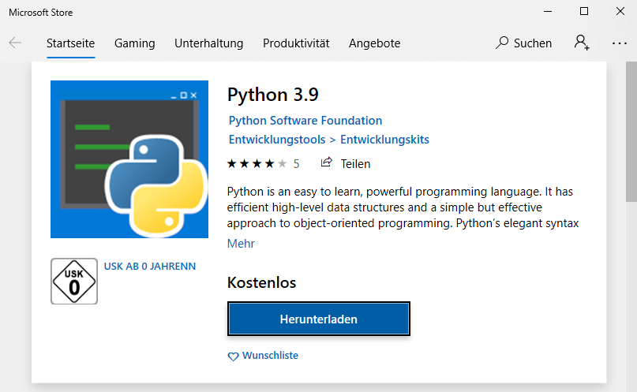
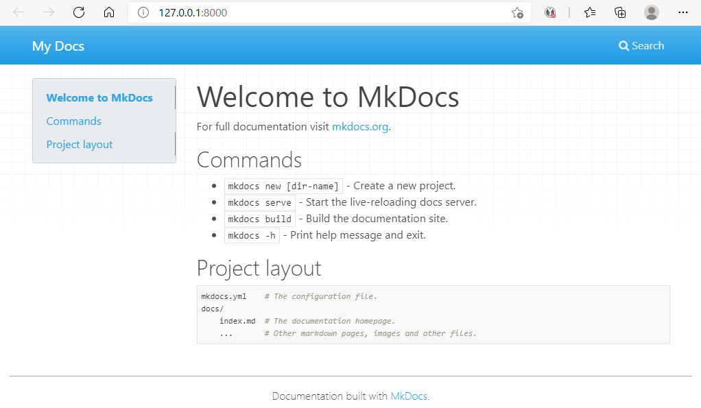
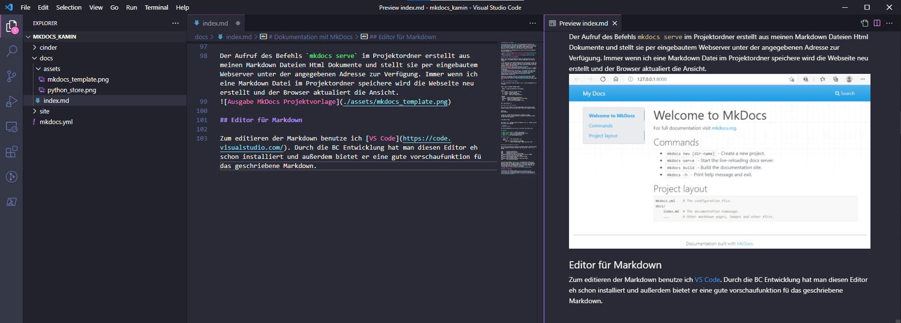

# Dokumentation mit MkDocs

[MkDocs](https://www.mkdocs.org/) ist ein Werkzeug zum Erstellen von statischen Webseiten. Der Inhalt der Webseiten wird in [Markdown](https://de.wikipedia.org/wiki/Markdown) beschrieben. MkDocs generiert daraus das Html zur Anzeige im Webbrowser. Man kann sich das in etwa wie das Kompilieren von Quellcode in ein ausführbares Programm vorstellen.

Wir setzen MkDocs zur Dokumentation von service pro 365 und allgemeiner Entwicklungsthemen ein.

- Hilfe zu service pro 365 [https://help.bss-it.de/](https://help.bss-it.de/)
- Entwicklungsthemen [https://dev.bss-it.de/](https://dev.bss-it.de/)

## Aufbau einer Entwicklungsumgebung

MkDocs ist in Python geschrieben es läuft auf jeder Plattform auf der Python läuft. Für Windows 10 gibt es mehrere wege MkDocs zum Laufen zu bringen:

1. Ich installiere eine Python Umgebung direkt unter Windows 10. Dass das nichts exotisches ist, sieht man, wenn man in eine Powershell einfach mal `python` eingibt. Hat man Python noch nicht intsalliert öffnet sich eine passende Seite im Microsoft Store.

Mit Hilfe des Python Paketmanagers PIP kann man dann, [wie auf der MkDocs Homepage beschrieben](https://www.mkdocs.org/#installing-mkdocs), MkDocs installieren,
2. Ich benutze das [Windows-Subsystem für Linux](https://docs.microsoft.com/de-de/windows/wsl/about) um mit MkDocs zu arbeiten. Wir haben eine [Distribution vorbereitet](https://dev.bss-it.de/anleitungen/doku/DokuAnleitung2/) in der alles Nötige zum Bearbeiten der BSS Dokumentationen enthalten ist.

Unsere [Dev Doku](https://dev.bss-it.de/anleitungen/overview/) enthält noch weitere Anleitungen auf denen die Arbeit mit unserer Doku und [Markdown](https://dev.bss-it.de/anleitungen/doku/anwendung/) beschrieben ist.

## Meine erste Webseite mit MkDocs

Ist alles installiert steht der Befehl `mkdocs` auf der Kommandozeile zur Verfügung. 

```
Usage: mkdocs [OPTIONS] COMMAND [ARGS]...

  MkDocs - Project documentation with Markdown.

Options:
  -V, --version  Show the version and exit.
  -q, --quiet    Silence warnings
  -v, --verbose  Enable verbose output
  -h, --help     Show this message and exit.

Commands:
  build      Build the MkDocs documentation
  gh-deploy  Deploy your documentation to GitHub Pages
  new        Create a new MkDocs project
  serve      Run the builtin development server
```

Sehr übersichtlich ;-) 

### Ordnerstruktur des Projekts

Mit `mkdocs new` gefolgt von einem Ordnernamen erstellt man ein neues Projekt. Wechselt man in den neuen Ordner findet man folgende Struktur.

```
mkdocs.yml
docs\index.md
```

`mkdocs.yml` enthält die Einstellungen für MkDocs wie Theme und Navigationsstruktur. Unsere gerade erst angelegte Projektdatei enthält nur den Titel der Webseite.

```
site_name: My Docs
```

Der Ordner `docs` enthält den Inhalt der Webseite. Der `new` Befehl hat auch eine erste Seite angelegt `index.md`.

```markdown
# Welcome to MkDocs

For full documentation visit [mkdocs.org](https://www.mkdocs.org).

## Commands

* `mkdocs new [dir-name]` - Create a new project.
* `mkdocs serve` - Start the live-reloading docs server.
* `mkdocs build` - Build the documentation site.
* `mkdocs -h` - Print help message and exit.

## Project layout

    mkdocs.yml    # The configuration file.
    docs/
        index.md  # The documentation homepage.
        ...       # Other markdown pages, images and other files.
```

### Anzeigen der Webseite im Browser

Wenn ich mir während des Erstellens der Markdown Dateien anschauen möchte wie das Ergebnis im Browser aussieht, kann ich das mit `mkdocs serve` machen.

```
INFO    -  Building documentation...
INFO    -  Cleaning site directory
INFO    -  Documentation built in 0.04 seconds
[I 210520 14:51:55 server:335] Serving on http://127.0.0.1:8000
INFO    -  Serving on http://127.0.0.1:8000
[I 210520 14:51:55 handlers:62] Start watching changes
INFO    -  Start watching changes
[I 210520 14:51:55 handlers:64] Start detecting changes
INFO    -  Start detecting changes
```

Der Aufruf des Befehls `mkdocs serve` im Projektordner erstellt aus meinen Markdown Dateien Html Dokumente und stellt sie per eingebautem Webserver unter der angegebenen Adresse zur Verfügung. Immer wenn ich eine Markdown Datei im Projektordner speichere wird die Webseite neu erstellt und der Browser aktualisiert die Ansicht.



### Erstellen und Veröffentlichen

Bin ich mit meiner Webseite zufrieden kann ich sie mit `mkdocs build` erstellen lassen. 

```
NFO    -  Cleaning site directory
INFO    -  Building documentation to directory: /mnt/c/Source/mkdocs_kamin/site
INFO    -  Documentation built in 0.58 seconds
```

Das Html für die Webseite wird in den Ordner `site` im Projektverzeichnis generiert. 

```
site:

assets
css
fonts
img
index.html
js
search
sitemap.xml
sitemap.xml.gz
```

Den Inhalt dieses Ordners muss man jetzt nur noch zum Webhoster seines Vertrauens hochladen.

Bei [Github](https://pages.github.com/) kann man dann auch gleich den Quellcode zur Webseite verwalten.

## Editor für Markdown

Zum Editieren von Markdown benutze ich [VS Code](https://code.visualstudio.com/). Durch die BC Entwicklung ist dieser Editor eh schon installiert und außerdem bietet er eine gute Vorschaufunktion für das geschriebene Markdown.

